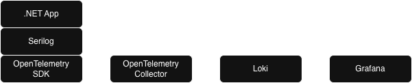
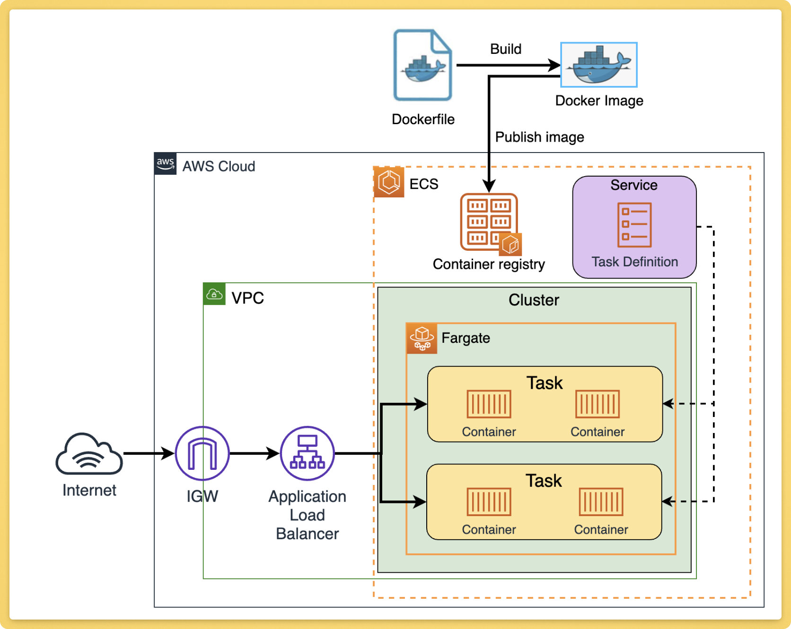
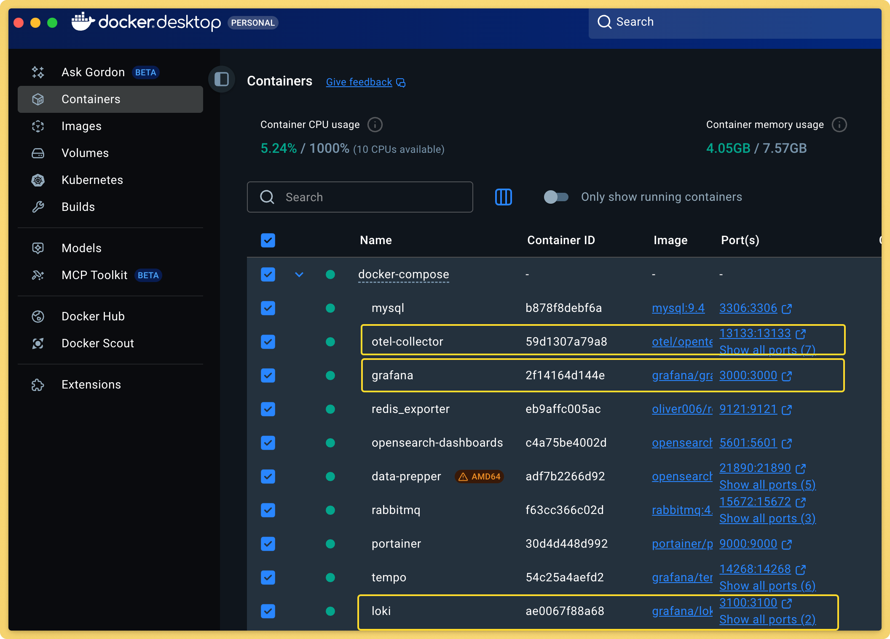
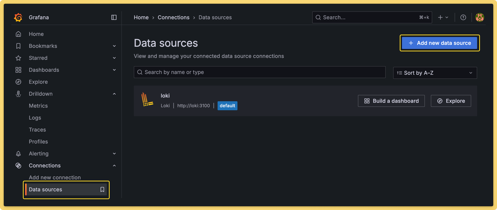
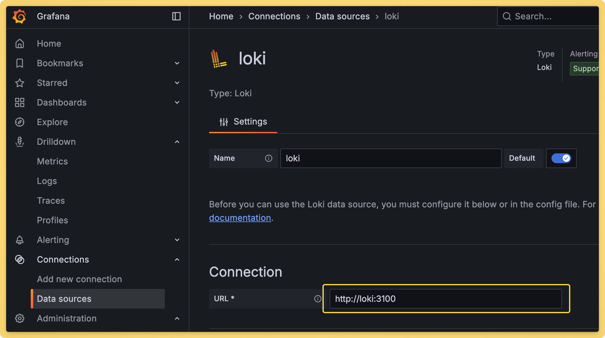
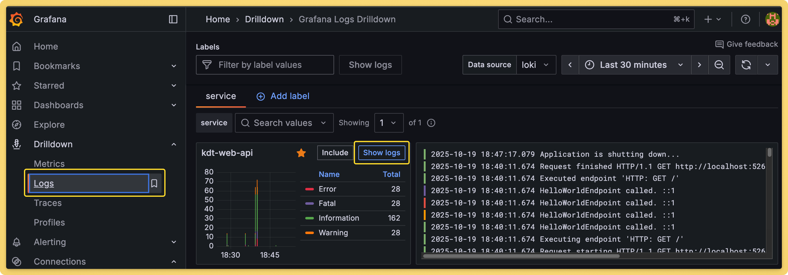
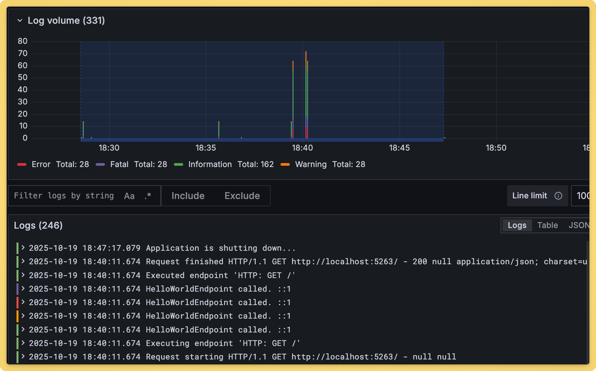

# Lesson 005

Log를 OpenTelemtry collector 로 전송하고 Loki, Grafana를 이용해서 로그를 확인한다.

## 필요 프로그램

[WSL2](https://cuffyluv.tistory.com/245)

Windows에서 Linux 환경을 실행하는 서브시스템

[Docker Desktop](https://docs.docker.com/desktop/)

컨테이너 개발 및 관리 도구

## 로그 전송 흐름



[Collector](https://opentelemetry.io/docs/collector/)

OpenTelemetry Collector는 다양한 소스에서 텔레메트리 데이터를 수집하고, 처리하고, 내보낼 수 있는 독립 실행형 서비스입니다.

[Loki](https://grafana.com/oss/loki/?plcmt=oss-nav)

로그 집계를 위한 시스템으로, 메트릭과 함께 로그를 효율적으로 저장하고 쿼리할 수 있도록 설계되었습니다.

[Grafana](https://grafana.com/oss/grafana/?plcmt=oss-nav)

Grafana는 데이터 시각화 및 모니터링 플랫폼

## 현대적 어플리케이션 작동 방식


ECS

[ECS](https://aws.amazon.com/ko/ecs/) 나 [Kubernetes](https://kubernetes.io/ko/docs/concepts/overview/) 환경에서 동작하기 때문에 개별 어플리케이션 로그를 Task나 Pod에 직접 접속해서 확인하기는 번거롭고 어렵다.

부하에 따라 서버들이 Scale-Out, Scale-In 되기 때문에 로그를 파일로 남겨도 사라지게 된다.

따라서 중앙 집중식 로그 관리 시스템을 구축하여, 모든 로그를 한 곳에서 수집, 저장, 분석할 수 있도록 하는 것이 중요하다.

## 컨테이너 실행

[docker-compose.yml](./docker-compose/docker-compose.yml)

```bash
>cd docker-compose
>docker-compose up -d
>docker ps -a
```



## Serilog OpenTelemetry 전송 설정

```bash
dotnet add package OpenTelemetry
dotnet add package OpenTelemetry.Exporter.OpenTelemetryProtocol
dotnet add package OpenTelemetry.Extensions.Hosting
dotnet add package Serilog.Enrichers.Environment
dotnet add package Serilog.Sinks.OpenTelemetry
```

```json
{
  "Name": "OpenTelemetry",
  "Args": {
    "Endpoint": "http://localhost:4317",
    "Protocol": "Grpc",
    "ResourceAttributes": {
      "service.name" : "kdt-web-api"
    }
  }
}
```

## 로그 확인

[Grafana](http://localhost:3000/)

admin / admin

```bash
# /docker-compose/.env.grafana

GF_SECURITY_ADMIN_USER=admin
GF_SECURITY_ADMIN_PASSWORD=admin
```





http://loki:3100




