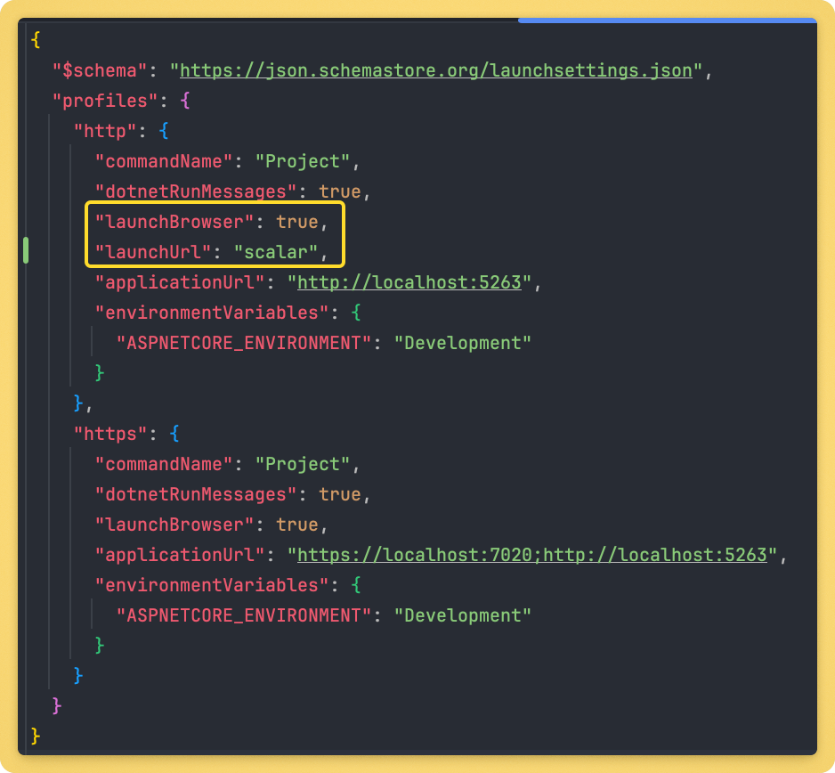
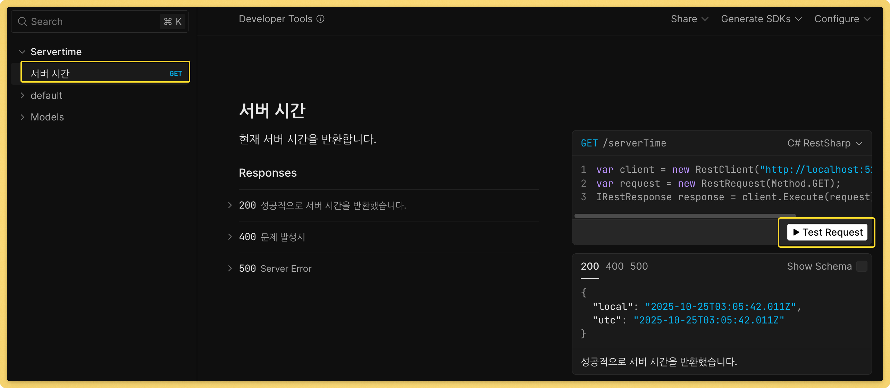

# Lesson 005

[Scalar](https://guides.scalar.com/scalar/scalar-api-references/integrations/net-aspnet-core/integration)

NuGet 패키지 Scalar.AspNetCore는 OpenAPI 문서를 기반으로 아름다운 API 참조를 렌더링하는 쉬운 방법을 제공합니다.

## 설치 Package

```bash
dotnet add package Microsoft.AspNetCore.OpenApi
dotnet add package Scalar.AspNetCore
```

## 실행 화면



[launchSettings.json](./Kdt.WebApi/Properties/launchSettings.json)




